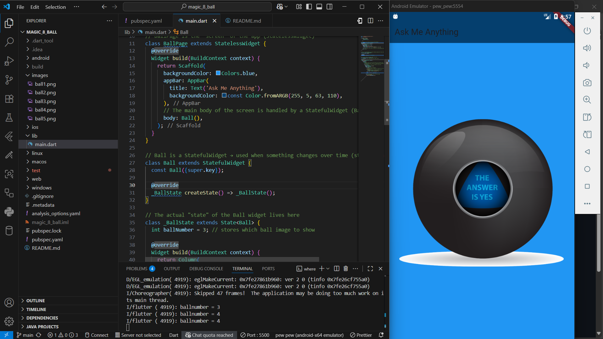

  

# 🎱 Ask Me Anything - Decision Maker App


*A fun Flutter project that helps you make decisions when you’re feeling indecisive!*  

---

## 📖 About the Project
Have you ever been stuck asking yourself questions like:
- *Should I study now or later?*  
- *What food should I eat today?*  
- *Is this my lucky day?*  

This app works like a **Magic 8-Ball** 🎱.  
Tap the ball, and it gives you a **random answer** — making decision-making **fun, playful, and fast**.  

---

## 🚀 Why This Project is Useful
- ✅ **Decision Making**: Helps break the “analysis paralysis” with random suggestions.  
- ✅ **Stress Relief**: Makes everyday decisions light-hearted.  
- ✅ **Practical Example**: Shows how randomness + UI updates can create engaging apps.  

---

## 🛠️ Built With
- [Flutter](https://flutter.dev/) - Cross-platform UI toolkit.  
- [Dart](https://dart.dev/) - Programming language for Flutter.  

---

## 📚 Flutter Basics Covered
This project is especially valuable for beginners because it covers the **core Flutter concepts**:

1. **MaterialApp & Scaffold** → The foundation of every Flutter app.  
2. **Stateless vs Stateful Widgets** → Knowing when your UI changes with state.  
3. **setState()** → The magic that updates your app on button presses.  
4. **Random()** → Add unpredictability and fun to apps.  
5. **Image.asset()** → Displaying and managing assets in Flutter.  
6. **Button Widgets** → Making UI interactive.  

Learning these basics makes you ready to build **real-world apps** (games, productivity tools, randomizers, and more).  

---

## 📷 Screenshot
Here’s what the app looks like in action:

  

---

## 🔮 Real-Life Usage
This simple app can be extended into:
- A **Decision Maker** app for quick choices.  
- A **Truth or Dare** randomizer.  
- A **Workout/Meal Planner** that picks options for you.  
- A **Virtual Dice Roller** for board games.  

---

## 💡 Getting Started
1. Clone the repo:
   ```bash
   git clone https://github.com/yoni-berihun/decision-maker-app.git


2. Navigate into the project folder:

```bash
    cd decision-maker-app
```
  3. Run the app:

   ```bash
   flutter pub get
   flutter run
   ```

---

##  Acknowledgement

Made with ❤️ by **[@yoni-berihun](https://github.com/yoni-berihun)**


